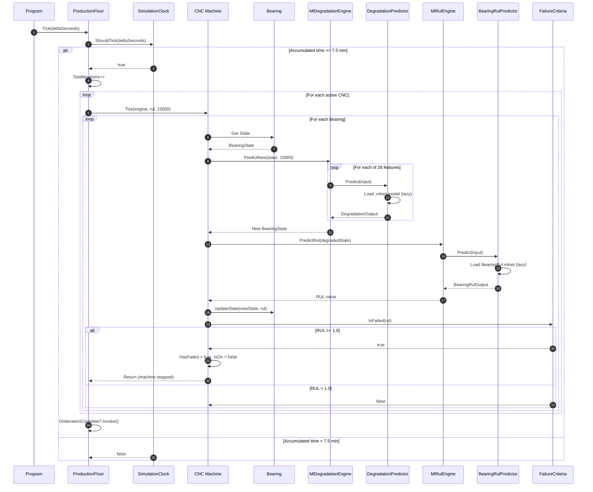
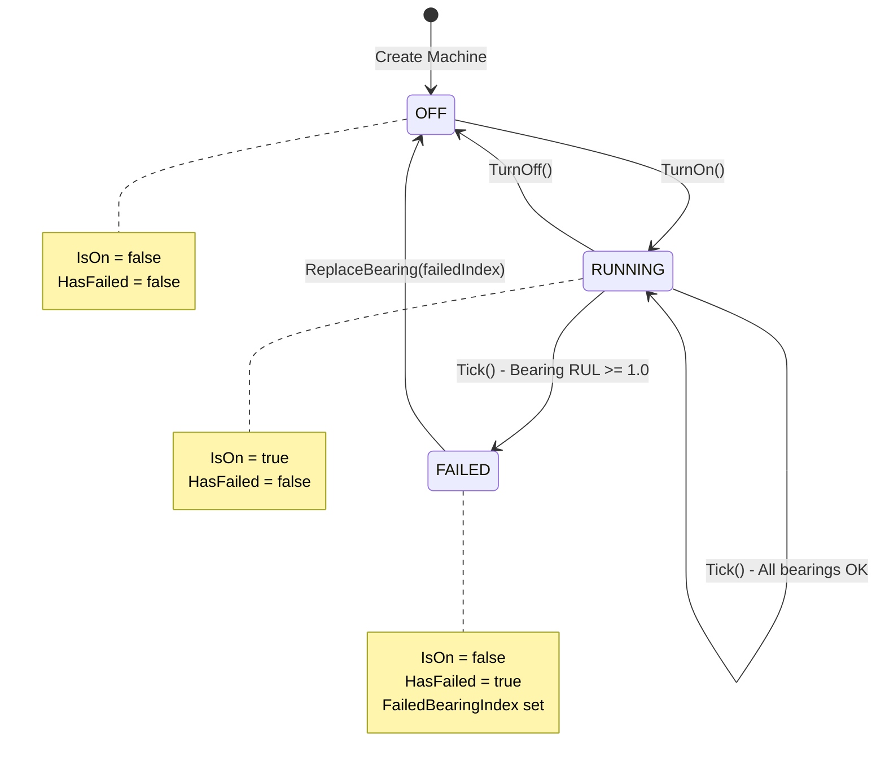

# CNC Production Floor Digital Twin - UML Class Diagram

This diagram shows the complete class structure of the CNC Predictive Maintenance system.

## Class Diagram

```mermaid
classDiagram
    direction TB

    %% ============================================
    %% CORE DOMAIN MODELS
    %% ============================================

    class ProductionFloor {
        <<singleton>>
        +Instance$ : ProductionFloor
        -_cncs : List~CNC~
        -_engine : IDegradationEngine
        -_rul : IRulEngine
        -_clock : SimulationClock
        +RevolutionsPerIteration$ : double
        +SecondsPerIteration$ : double
        +Machines : IReadOnlyList~CNC~
        +TimeMultiplier : double
        +AccumulatedSeconds : double
        +TotalIterations : int
        +IsPaused : bool
        +ActiveMachineCount : int
        +FailedMachineCount : int
        +TotalBearingCount : int
        +OnBearingFailed : Action~CNC, int~
        +OnIterationComplete : Action~int~
        +Tick(realDeltaSeconds: double) void
        +ForceTick() void
        +SetTimeMultiplier(multiplier: double) void
        +Pause() void
        +Resume() void
        +Reset() void
        +AddCnc(cnc: CNC) void
        +RemoveCnc(id: Guid) bool
        +GetCnc(id: Guid) CNC
        +GetCncByIndex(index: int) CNC
        +GetBearingsNeedingAttention(threshold: double) IEnumerable
    }

    class CNC {
        -ModelNames$ : string[]
        +Id : Guid
        +Model : string
        +Bearings : Bearing[]
        +IsOn : bool
        +HasFailed : bool
        +FailedBearingIndex : int?
        +CNC(modelName: string)
        +TurnOn() bool
        +TurnOff() void
        +TogglePower() void
        +Tick(degradation: IDegradationEngine, rulEngine: IRulEngine, revolutionsStep: double) void
        +ReplaceBearing(index: int) void
        +GetLowestRul() double
        +GetMostDegradedBearing() Bearing
    }

    class Bearing {
        -PositionNames$ : string[]
        +Index : int
        +Position : string
        +State : BearingState
        +RUL : double
        +HealthPercentage : double
        +Bearing(index: int)
        +UpdateState(next: BearingState, rul: double) void
        +GetHealthStatus() string
    }

    class BearingState {
        <<record>>
        +Rms : double
        +Peak : double
        +CrestFactor : double
        +Kurtosis : double
        +Skewness : double
        +StdDev : double
        +PeakToPeak : double
        +Mean : double
        +Variance : double
        +DominantFrequency_Hz : double
        +DominantFrequency_Mag : double
        +Energy_0_500Hz : double
        +Energy_500_1000Hz : double
        +Energy_1000_2000Hz : double
        +Energy_2000_4000Hz : double
        +Energy_4000_6000Hz : double
        +Energy_6000_8000Hz : double
        +Energy_8000_10240Hz : double
        +EnergyBPFO : double
        +EnergyBPFI : double
        +EnergyBSF : double
        +EnergyFTF : double
        +EnergyBPFO_2x : double
        +EnergyBPFI_2x : double
        +EnergyBPFO_3x : double
        +EnergyBPFI_3x : double
        +Revolutions : double
        +RUL : double
    }

    class SimulationClock {
        +TimeMultiplier : double
        -SecondsPerIteration : double
        -_accumulatorSeconds : double
        +AccumulatedSeconds : double
        +ProgressToNextTick : double
        +ShouldTick(realDeltaSeconds: double) bool
        +Reset() void
    }

    class FailureCriteria {
        <<static>>
        +BearingFailureRul$ : double
        +IsFailed$(rul: double) bool
    }

    %% ============================================
    %% BEARING INITIALIZATION
    %% ============================================

    class BearingInitializer {
        <<singleton>>
        +Instance$ : BearingInitializer
        -_random$ : Random
        +CreateInitialState() BearingState
        -RandomInRange(bounds: Tuple) double
    }

    class Bounds {
        <<static>>
        +Rms$ : Tuple~double, double~
        +Peak$ : Tuple~double, double~
        +CrestFactor$ : Tuple~double, double~
        +Kurtosis$ : Tuple~double, double~
        +Skewness$ : Tuple~double, double~
        +StdDev$ : Tuple~double, double~
        +PeakToPeak$ : Tuple~double, double~
        +Mean$ : Tuple~double, double~
        +Variance$ : Tuple~double, double~
        +DominantFrequency_Hz$ : Tuple~double, double~
        +DominantFrequency_Mag$ : Tuple~double, double~
        +Energy_0_500Hz$ : Tuple~double, double~
        +EnergyBPFO$ : Tuple~double, double~
        +... : Tuple~double, double~
    }

    %% ============================================
    %% DEGRADATION ENGINE
    %% ============================================

    class IDegradationEngine {
        <<interface>>
        +PredictNext(current: BearingState, revolutionsStep: double) BearingState
    }

    class MlDegradationEngine {
        -_predictors : Dictionary~string, DegradationPredictor~
        +MlDegradationEngine()
        +PredictNext(current: BearingState, revolutionsStep: double) BearingState
        -ToInput(s: BearingState) DegradationInput
    }

    %% ============================================
    %% RUL ENGINE
    %% ============================================

    class IRulEngine {
        <<interface>>
        +PredictRul(state: BearingState) double
    }

    class MlRulEngine {
        -_predictor : BearingRulPredictor
        +PredictRul(state: BearingState) double
    }

    %% ============================================
    %% ML.NET PREDICTORS
    %% ============================================

    class IPredictor~TInput, TOutput~ {
        <<interface>>
        +ModelName : string
        +Predict(input: TInput) TOutput
    }

    class DegradationPredictor {
        -ResourcesPath$ : string
        +AvailableModels$ : string[]
        -_modelName : string
        -_predictionEngine : Lazy~PredictionEngine~
        +ModelName : string
        +DegradationPredictor(modelName: string)
        +Predict(input: DegradationInput) DegradationOutput
        +IsModelAvailable$(modelName: string) bool
        +GetAvailableModels$() IEnumerable~string~
        -CreatePredictionEngine() PredictionEngine
    }

    class BearingRulPredictor {
        -ModelPath$ : string
        -_predictionEngine : Lazy~PredictionEngine~
        +ModelName : string
        +BearingRulPredictor()
        +Predict(input: BearingRulInput) BearingRulOutput
        -CreatePredictionEngine() PredictionEngine
    }

    %% ============================================
    %% ML.NET INPUT/OUTPUT MODELS
    %% ============================================

    class DegradationInput {
        +RMS : float
        +Peak : float
        +CrestFactor : float
        +Kurtosis : float
        +Skewness : float
        +StdDev : float
        +PeakToPeak : float
        +Mean : float
        +Variance : float
        +DominantFreq_Hz : float
        +DominantFreq_Mag : float
        +Energy_0_500Hz : float
        +... : float
        +Revolutions : float
    }

    class DegradationOutput {
        +PredictedValue : float
    }

    class BearingRulInput {
        +RMS : float
        +Peak : float
        +CrestFactor : float
        +Kurtosis : float
        +... : float
        +Revolutions : float
    }

    class BearingRulOutput {
        +RemainingUsefulLife : float
    }

    %% ============================================
    %% RELATIONSHIPS
    %% ============================================

    %% Composition
    ProductionFloor *-- "1" SimulationClock : contains
    ProductionFloor *-- "1" IDegradationEngine : contains
    ProductionFloor *-- "1" IRulEngine : contains
    ProductionFloor *-- "*" CNC : manages
    CNC *-- "2..4" Bearing : contains
    Bearing *-- "1" BearingState : has current

    %% Implementation
    MlDegradationEngine ..|> IDegradationEngine : implements
    MlRulEngine ..|> IRulEngine : implements
    DegradationPredictor ..|> IPredictor : implements
    BearingRulPredictor ..|> IPredictor : implements

    %% Dependencies
    MlDegradationEngine --> DegradationPredictor : uses 26 instances
    MlDegradationEngine --> DegradationInput : creates
    MlDegradationEngine --> DegradationOutput : reads
    MlRulEngine --> BearingRulPredictor : uses
    MlRulEngine --> BearingRulInput : creates
    MlRulEngine --> BearingRulOutput : reads
    Bearing --> BearingInitializer : initializes from
    BearingInitializer --> Bounds : reads ranges
    CNC --> FailureCriteria : checks failure
    DegradationPredictor --> "*.mlnet" : loads model
    BearingRulPredictor --> "BearingRul.mlnet" : loads model
```

## Sequence Diagram - Simulation Tick



## Component Diagram

```mermaid
flowchart TB
    subgraph Console["Console Application"]
        Program[Program.cs<br/>Interactive UI]
    end

    subgraph Core["Core Domain"]
        PF[ProductionFloor<br/>Singleton Manager]
        CNC[CNC<br/>Machine Entity]
        Bearing[Bearing<br/>Component]
        State[BearingState<br/>Record]
        Clock[SimulationClock]
        Failure[FailureCriteria]
    end

    subgraph Init["Initialization"]
        BI[BearingInitializer]
        Bounds[Bounds<br/>Value Ranges]
    end

    subgraph Engines["Prediction Engines"]
        IDE[IDegradationEngine]
        MDE[MlDegradationEngine]
        IRE[IRulEngine]
        MRE[MlRulEngine]
    end

    subgraph ML["ML.NET Library"]
        DP[DegradationPredictor]
        RP[BearingRulPredictor]
        DI[DegradationInput]
        DO[DegradationOutput]
        RI[BearingRulInput]
        RO[BearingRulOutput]
    end

    subgraph Models["Trained Models"]
        DM["26x Degradation<br/>.mlnet files"]
        RM["BearingRul.mlnet"]
    end

    Program --> PF
    PF --> CNC
    PF --> Clock
    CNC --> Bearing
    Bearing --> State
    Bearing --> BI
    BI --> Bounds
    CNC --> Failure

    PF --> IDE
    PF --> IRE
    IDE <|.. MDE
    IRE <|.. MRE

    MDE --> DP
    MRE --> RP
    DP --> DI
    DP --> DO
    RP --> RI
    RP --> RO

    DP --> DM
    RP --> RM
```

## State Diagram - Bearing Health

```mermaid
stateDiagram-v2
    [*] --> GOOD: Initialize (RUL = 0)

    GOOD --> GOOD: RUL < 0.5
    GOOD --> FAIR: RUL >= 0.5

    FAIR --> FAIR: 0.5 <= RUL < 0.7
    FAIR --> WARNING: RUL >= 0.7

    WARNING --> WARNING: 0.7 <= RUL < 0.9
    WARNING --> CRITICAL: RUL >= 0.9

    CRITICAL --> CRITICAL: 0.9 <= RUL < 1.0
    CRITICAL --> FAILED: RUL >= 1.0

    FAILED --> [*]: Machine Shutdown

    note right of GOOD: Health: 50-100%
    note right of FAIR: Health: 30-50%
    note right of WARNING: Health: 10-30%<br/>Schedule Maintenance
    note right of CRITICAL: Health: 0-10%<br/>Immediate Action
    note right of FAILED: Health: 0%<br/>Bearing Replacement Required
```

## State Diagram - CNC Machine



---

## How to View

1. **GitHub** - Just view this file on GitHub, Mermaid diagrams render automatically
2. **VS Code** - Install "Markdown Preview Mermaid Support" extension
3. **Online** - Paste into [mermaid.live](https://mermaid.live)
4. **Export** - Use mermaid.live to export as SVG/PNG
